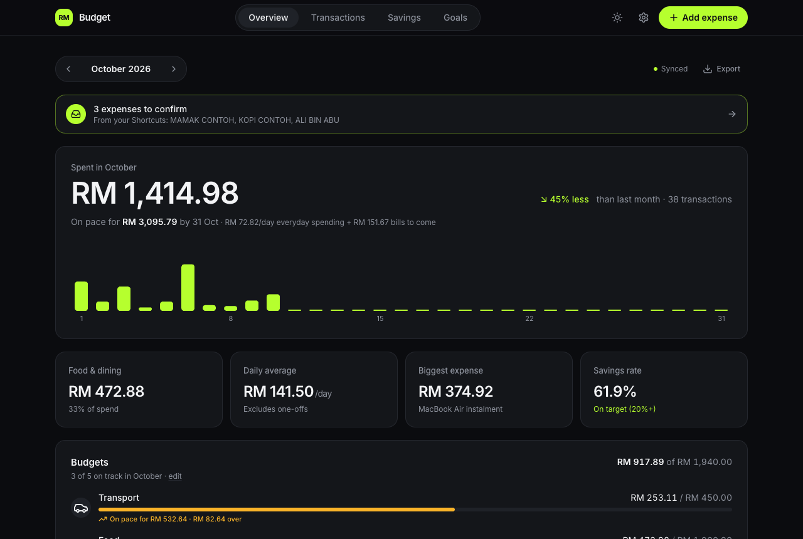
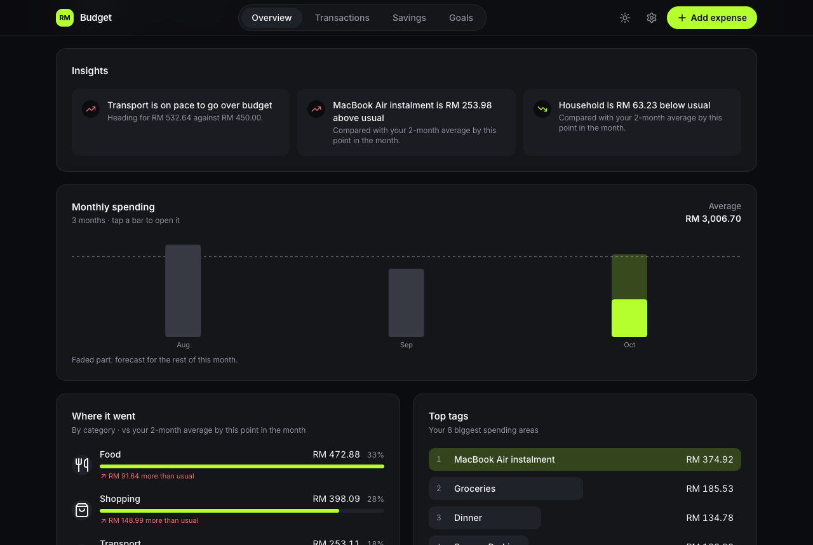
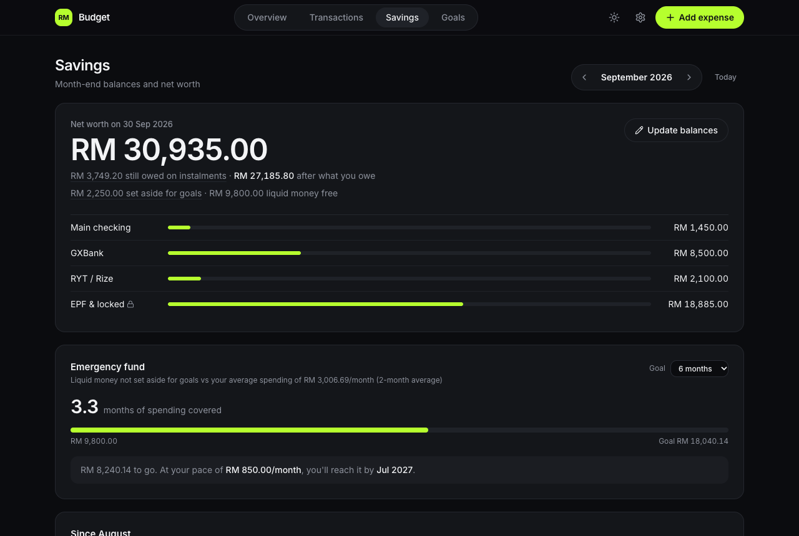
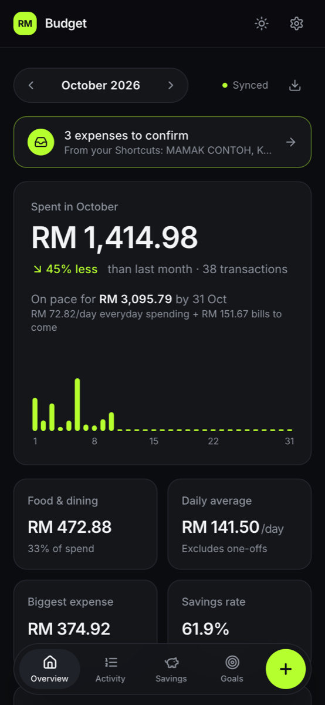
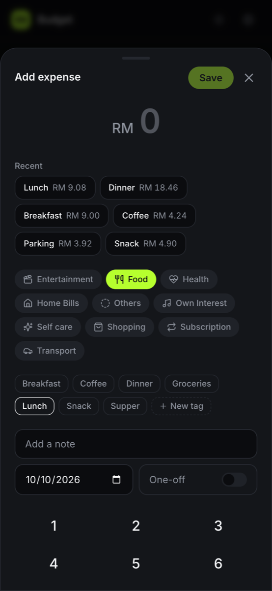

# 💰 Personal Monthly Budget & Wealth Tracker (Web & Mobile PWA)

A full-stack, mobile-first personal finance app that replaced my Excel budget sheet: log an expense in a few taps on the phone, and get the analytics a spreadsheet never gave me — where the month is heading, what's unusual, which bills are still unpaid and how long my savings would last.

Hosted $100\%$ free on **Vercel** and **Supabase (PostgreSQL)** with no expiring trial periods or server costs.

## 👀 Try It Without an Account

**Live app: [budget-tracker-gold-sigma.vercel.app](https://budget-tracker-gold-sigma.vercel.app)**

On the sign-in page, choose **Continue without an account**. You get the full app with made-up sample data:

- Add, edit and delete expenses, set up monthly bills, categories and savings balances
- Explore the analytics: month-end forecast, insights, spending calendar, savings rate and emergency fund
- Works on your phone too, and can be added to the home screen

Guest mode never touches the database and stores nothing in your browser, so **nothing you enter is saved**: a refresh starts over.

## 📸 Screenshots

| Overview | Analytics |
| :---: | :---: |
|  |  |

| Savings | Mobile | Add expense |
| :---: | :---: | :---: |
|  |  |  |

*All screenshots use the app's made-up demo data.*

---

## 📱 Highlights & Features

### ⚡ Fast entry
- **Add an expense in a few taps**: numpad sheet, **Recent** shortcuts (tag + last amount), and a tag picked for the time of day (breakfast, lunch, dinner…), which keeps working if you rename it.
- **Edit or delete** any entry, with a 5-second **Undo**; failed saves roll back with **Retry**.
- **Your own categories and tags** (with icons), created in Settings or on the spot while adding.
- Installable **PWA** for iOS/Android home screens; keyboard entry on desktop.

### 📊 Analytics
- **Month-end forecast**: "On pace for RM 2,084 by 30 Sep", from everyday spending plus bills still to come.
- **Compared with usual**: each category against its 3-month average (pro-rated for the current month).
- **Insights**: plain-English highlights such as tags above or below usual, no-spend days and weekend-heavy spending.
- **Monthly trend**, **spending calendar** (days shaded by spend), **fixed vs flexible** split and **year to date**.

### 🤖 Automation
- **iPhone Shortcuts send expenses to an Inbox**: double-tap the back of the phone on a TnG (or any) payment screen and it's read on the phone and sent; Apple Pay purchases can be sent automatically; or say "Hey Siri, log expense".
- **Inbox to confirm**: amount, merchant and date are filled in; check, pick or change the tag, and add. Nothing goes into your spending unconfirmed.
- **Merchant rules**: confirming "Tealive → Coffee" means the next Tealive payment arrives already tagged.
- **Personal tokens** (Settings → Automation): only a hash is stored, a token can only add Inbox items (never read data), and it can be revoked any time.

### 🧾 Monthly bills
- Choose which tags are monthly bills, with an optional **expected amount** and **due day**.
- Overview shows **Logged / Due in 2 days / Overdue / Missing**, and logs unpaid bills in one tap.
- **Instalment plans** are bills that end: they only count (forecast, budgets, reminders, auto-add) from the first payment to the last.
- **Auto-add** fixed bills on their due day via a daily **pg_cron** job in Postgres.

### 🚦 Budgets & reminders
- **Monthly budget per category**: Overview shows spend against each limit, the pace ("on pace for RM 430"), what's left per day, and flags budgets at risk or over.
- **Phone notifications** around 8pm: bills due tomorrow or overdue, goal vouchers about to expire, budgets at 80% or over, and an optional "nothing logged today" nudge. Each is sent once; Settings shows a preview of what would go out tonight.

### 🏦 Savings & salary
- **Malaysian salary engine**: EPF, SOCSO and EIS deductions, take-home pay and savings rate (editable).
- **Your own savings accounts** (banks, e-wallets, EPF, investments): add, rename or archive them, mark each as liquid or locked, and record month-end balances with daily-compounded interest estimates.
- **Emergency fund**: months of spending covered, a goal, and when you'll reach it at your pace.
- **Where it changed**: balance changes by account, the **untracked cash** check (growth vs. what the budget says you saved) and **savings rate by month**.

### 🎯 Goals
- Save toward things you want: progress, "set aside RM X/month to make it by <date>" with **on track / behind**, or when you'll be ready at your pace.
- **Trade-in value** and **discounts & vouchers** (RM or %, with expiry dates) come off the target; expiring vouchers are flagged, expired ones stop counting.
- **Bought it** logs what you paid as a one-off expense; money set aside for goals is kept separate from your emergency fund.
- **Bought on instalments** (Atome, SPayLater, 0% card plans…): down payment (prefilled with what you set aside), number of payments and optional interest/fees. Each payment becomes a monthly bill that ends after the last one, with reminders and auto-add; the goal shows **Paying off: 2 of 12 paid · RM 3,749 left**, and Savings shows what's still owed and **net worth after what you owe**.

### 🔐 Data & privacy
- **Email + password sign-in**, no public sign-up; every table locked with owner-only **Row-Level Security**.
- **Multiple accounts**: friends get their own separate data (categories and tags included), starting from a default set. Accounts are added in the Supabase dashboard; each person can change their password in Settings.
- **Guest mode** with generated demo data, isolated from the database.
- **Export**: month or all expenses as Excel-friendly CSV, savings balances, or a full JSON backup.
- **Weekly encrypted backups** of the whole database (GitHub Actions + age), tested by a restore in CI; see [Backups](#6-backups-recommended).
- **Background job health**: Settings → Account shows when reminders, bill auto-add and backups last ran; Overview warns when one fails or stops.
- Refined dark theme with a light mode, and layouts that adapt to touch and mouse.

---

## 📖 Using the App

The [**User Guide**](docs/user-guide.md) explains every feature step by step: adding expenses, bills and instalments, budgets, goals, savings, reminders, automation with iPhone Shortcuts, and troubleshooting. Inside the app, **Settings → Help** has the short version.

---

## 🛠️ Tech Stack

- **Frontend & App Framework**: [Next.js 15 (App Router)](https://nextjs.org/) + [React 19](https://react.dev/)
- **Styling & UI**: [Tailwind CSS](https://tailwindcss.com/) + [Lucide Icons](https://lucide.dev/) + Inter font
- **Charts & Visualizations**: [Recharts](https://recharts.org/) plus custom accessible bar lists and a calendar heatmap
- **Database & Authentication**: [Supabase (PostgreSQL)](https://supabase.com/) with Row-Level Security (RLS) and `pg_cron`
- **PWA & notifications**: Web App Manifest, home-screen icons, a push-only service worker and Web Push (VAPID, [`web-push`](https://github.com/web-push-libs/web-push))
- **Hosting & jobs**: [Vercel](https://vercel.com/) (free Hobby tier) with Vercel Cron for daily reminders
- **Quality**: TypeScript, ESLint, Vitest (logic, receipt reading, the ingest endpoint, and every migration + RLS replayed on PGlite), GitHub Actions CI on every push and PR

Why these tools and the main design choices: [`docs/decisions.md`](docs/decisions.md).

---

## 🏗️ Architecture Overview

```
┌─────────────────────────────────────────────────────────────┐
│                       CLIENT TIER                           │
│  📱 Mobile PWA (Add to Home Screen)  |  💻 Desktop Browser  │
└──────────────────────────────┬──────────────────────────────┘
                               │ HTTPS / JSON
┌──────────────────────────────▼──────────────────────────────┐
│                  APPLICATION TIER (VERCEL)                  │
│  • Next.js App Router (No cold starts, 0 server cost)       │
│  • Salary, Interest & Daily Burn Rate Math Engines         │
│  • Optimistic UI Updates (< 1ms)                            │
│  • Vercel Cron: daily reminders via Web Push (8pm MYT)      │
└──────────────────────────────┬──────────────────────────────┘
                               │ Authenticated REST API
┌──────────────────────────────▼──────────────────────────────┐
│                  DATABASE TIER (SUPABASE)                   │
│  • PostgreSQL 16 Relational Engine                          │
│  • Row-Level Security (RLS): each account sees only its own │
│  • Trigger: new accounts get default categories and tags    │
│  • pg_cron: daily auto-add of due monthly bills             │
└─────────────────────────────────────────────────────────────┘
```

---

## 🗄️ Database Schema & Setup

### 1. Initial Tables Setup
Execute the following SQL in your **Supabase SQL Editor**:

```sql
-- 1. Enable UUID Extension
create extension if not exists "uuid-ossp";

-- 2. User Profiles & Salary Defaults
create table public.user_profiles (
  id uuid references auth.users on delete cascade primary key,
  email text,
  default_gross_salary numeric(10, 2) default 3500.00,
  epf_rate numeric(5, 4) default 0.1100,
  socso_rate numeric(10, 2) default 17.25,
  eis_rate numeric(10, 2) default 6.90,
  created_at timestamptz default now()
);

-- 3. Categories Taxonomy
create table public.categories (
  id uuid primary key default uuid_generate_v4(),
  name text not null unique,
  color text default '#3b82f6',
  icon text -- lucide icon key chosen in Settings; NULL = default by name
);

-- 4. Tags Taxonomy (Linked to Categories)
create table public.tags (
  id uuid primary key default uuid_generate_v4(),
  category_id uuid references public.categories(id) on delete cascade not null,
  name text not null,
  unique(category_id, name)
);

-- 5. Transactions Ledger
create table public.transactions (
  id uuid primary key default uuid_generate_v4(),
  user_id uuid references auth.users on delete cascade,
  date date not null default current_date,
  category_id uuid references public.categories(id) not null,
  tag_id uuid references public.tags(id) not null,
  amount numeric(10, 2) not null check (amount > 0),
  description text,
  is_one_off boolean not null default false,
  created_at timestamptz default now()
);

create index idx_transactions_user_date on public.transactions(user_id, date);

-- 6. Monthly Savings Snapshots
create table public.monthly_savings (
  id uuid primary key default uuid_generate_v4(),
  user_id uuid references auth.users on delete cascade,
  month date not null, -- Stored as YYYY-MM-01
  main_checking numeric(12, 2) default 0.00,
  gx_bank numeric(12, 2) default 0.00,
  gx_rate numeric(5, 4) default 0.0355,
  ryt_bank numeric(12, 2) default 0.00,
  ryt_rate numeric(5, 4) default 0.0000,
  epf_locked numeric(12, 2) default 0.00,
  unique(user_id, month)
);

-- 7. Recurring Bills Sentinel Configuration
create table public.recurring_sentinel (
  id uuid primary key default uuid_generate_v4(),
  user_id uuid references auth.users on delete cascade,
  tag_id uuid references public.tags(id) not null,
  is_active boolean default true
);

-- 8. Row-Level Security (RLS) Policies
alter table public.user_profiles enable row level security;
alter table public.categories enable row level security;
alter table public.tags enable row level security;
alter table public.transactions enable row level security;
alter table public.monthly_savings enable row level security;

create policy "Allow public read categories" on public.categories for select using (true);
create policy "Allow public read tags" on public.tags for select using (true);
create policy "Allow all transactions access" on public.transactions for all using (true) with check (true);
create policy "Allow all savings access" on public.monthly_savings for all using (true) with check (true);
```

### 2. Import Your Spreadsheet (optional)
To bring in history from an Excel budget sheet (same layout as `Monthly Budget.xlsm`):
1. Generate a seed script from your file:
   ```bash
   python3 scripts/migrate_excel.py "path/to/Monthly Budget.xlsm"
   ```
   This writes `scripts/seed_data.sql` (categories, tags, transactions and savings snapshots). The savings go into the old `monthly_savings` table; `2026-09-30_savings_accounts.sql` (below) turns them into accounts.
2. Paste it into the Supabase SQL Editor and click **Run**.

Your spreadsheet and the generated `seed_data.sql` contain real financial data, so both are **gitignored**; keep them out of the repository.

Without a spreadsheet, the app still works: add categories and tags in **Settings**, or try it first with **Continue without an account** (sample data, nothing saved).

### 3. Lock the Database to Your Account
The seed script opens the tables so data can be loaded. Close them afterwards:
1. Supabase Dashboard → **Authentication → Users → Add user → Create new user** with your email and a strong password (tick **Auto Confirm User**).
2. **Authentication → Sign In / Providers → Email** → turn off **Allow new users to sign up**.
3. Set your email in [`scripts/secure_rls.sql`](scripts/secure_rls.sql) and run it in the SQL Editor.

This assigns all data to your user and replaces every policy with owner-only RLS. Then run the migrations below; `2026-09-30_multi_user.sql` makes categories and tags per account too. The app then requires sign-in (`/login`). **Do not re-run `seed_data.sql` afterwards**; it re-opens the tables.

### 4. Migrations
One-off SQL changes for existing databases live in [`scripts/migrations/`](scripts/migrations/). Run each new file once in the SQL Editor, in the order listed here (files from the same day depend on each other). The tests replay this list in this order, and fail if a file in the folder is missing from it:
- `2026-09-28_manage_categories_tags.sql`: adds `categories.icon` and lets the owner add, rename and delete categories and tags.
- `2026-09-28_monthly_bills.sql`: adds expected amount and due day to `recurring_sentinel`, one row per bill, and carries over the 8 bills the app used to hard-code.
- `2026-09-28_auto_bills.sql`: per-bill "Add automatically" switch and a daily `pg_cron` job (00:05 Malaysia time) that adds due auto bills. Needs the `pg_cron` extension (Dashboard → Database → Extensions).
- `2026-09-28_emergency_goal.sql`: adds `user_profiles.emergency_months` (emergency fund goal on the Savings page, default 6).
- `2026-09-29_goals.sql`: `goals` (targets with optional trade-in and discounts) and `goal_contributions` (money set aside) tables, owner-only RLS. Re-runnable: running it again adds anything new.
- `2026-09-29_budgets.sql`: `budgets` table (monthly limit per category), owner-only RLS.
- `2026-09-29_reminders.sql`: `push_subscriptions` (devices), `reminder_settings` (which reminders) and `reminder_log` (what was already sent) for phone notifications. See [Reminders](#5-reminders-optional).
- `2026-09-30_multi_user.sql`: each account gets its own categories and tags (existing ones stay yours), category names are unique per account, expenses/bills/budgets can only use your own categories and tags, and new accounts start with a profile and a default set of categories and tags. See [Adding a friend](#adding-a-friend). After this, `secure_rls.sql` refuses to run (it would re-open categories and tags).
- `2026-09-30_roles.sql`: marks each account's food category and meal tags (breakfast, lunch, tea time, dinner, late night) so the Food & dining card and the time-of-day tag in Add expense keep working after renames; new accounts also get a Supper tag. Starred in Settings → Categories & tags.
- `2026-09-30_savings_accounts.sql`: savings become per-person accounts (`savings_accounts`) with a month-end balance each (`savings_balances`) instead of the fixed Main checking / GXBank / RYT / EPF columns. Your history is copied over (same account names, net worth per month unchanged; the last query shows before/after); `monthly_savings` is kept as a backup.
- `2026-10-01_instalments.sql`: instalment plans on monthly bills (number of payments, first payment month, linked goal, price and down payment), owner checks for the linked goal, and the daily auto-add job skipping plans outside their months.
- `2026-10-03_inbox.sql`: `api_tokens` (hashed personal tokens), `inbox_items` (captured expenses to confirm) and `merchant_rules` (merchant → tag), owner-only, for Settings → Automation and the Inbox. The endpoint `/api/ingest` needs `SUPABASE_SERVICE_ROLE_KEY` (same as reminders).
- `2026-10-03_inbox_reference.sql`: a `reference` on Inbox items (a receipt's reference numbers), so the same receipt sent twice is only added once.
- `2026-10-04_job_runs.sql`: `job_runs`, a log of background jobs (nightly reminders, the nightly bill auto-add, weekly backups, Shortcut errors) shown in Settings → Account, with a warning on Overview when one fails or stops running. The auto-add job now logs each run. Its last query runs the auto-add once (adding any bill due today, as tonight's run would).
- `2026-10-04_goal_contributions_owner.sql`: money set aside for a goal must be for one of your own goals (the same check every other reference has). Its last query should show 0.
- `2026-10-04_merchant_rule_categories.sql`: merchant rules remember a category, with the tag optional ("TEALIVE → Food", the meal still by payment time), for Settings → Automation → Shops it remembers. Existing rules keep their tag and get its category.
- `2026-10-08_instalments_by_amount.sql`: instalment plans count payments by amount (paying early, two months at once or the rest at once all count); the nightly auto-add only adds what's still short for the month. Its last query shows each plan's total and paid.
- `2026-10-08_instalments_category.sql`: an "Instalments" category (renamable, not deletable) for plans bought from Goals; existing ones move there with their past payments. Plans made in Settings → Monthly bills stay where they are. Its last query lists each plan and its category.
- `2026-10-08_category_order.sql`: your own order for categories (Settings → Categories & tags → Reorder); existing ones start in alphabetical order.

### Adding a friend
Sign-up stays off, so strangers can't create accounts. To give someone their own account:
1. Supabase Dashboard → **Authentication → Users → Add user → Create new user**: their email, a temporary password, and tick **Auto Confirm User** (no email is sent).
2. Send them the app link, their email and the temporary password.
3. They sign in and change it in **Settings → Account → Change password**.

They start with the default categories and tags and see none of your data; you see none of theirs. To remove someone, delete the user in the same screen: all their data is deleted with them.

---

## 🚀 Getting Started Locally

### 1. Prerequisites
- **Node.js**: v20+ or v22+
- **Git**
- A free account on [Supabase](https://supabase.com)
- A free account on [Vercel](https://vercel.com)

### 2. Install Dependencies
```bash
npm install
```

### 3. Configure Environment Variables
Create `.env.local` in your root directory:

```env
NEXT_PUBLIC_SUPABASE_URL=https://your-project-id.supabase.co
NEXT_PUBLIC_SUPABASE_ANON_KEY=your-anon-public-key
```
Use the **publishable** key (`sb_publishable_…`) on newer Supabase projects, or the legacy **anon** key; both are public by design (RLS protects the data). Never put the **secret** key here.

### 4. Available Commands
```bash
npm run dev         # Start local development server on http://localhost:3000
npm run type-check  # Verify TypeScript compilation (tsc --noEmit)
npm run lint        # ESLint (flat config in eslint.config.mjs)
npm test            # All tests (Vitest): logic, receipt reading, /api/ingest, database + RLS
npm run test:watch  # Re-run tests as you edit
npm run build       # Build optimized Next.js production bundle
```

### 5. Reminders (optional)
Phone notifications are sent by a daily Vercel Cron job (`vercel.json`, 12:00 UTC = 8pm Malaysia time) that calls `/api/reminders`. To turn them on:

1. Run `scripts/migrations/2026-09-29_reminders.sql` in the Supabase SQL Editor.
2. Generate a key pair: `npx web-push generate-vapid-keys`.
3. Add these environment variables in Vercel (Project → Settings → Environment Variables), then redeploy:

   | Variable | Value |
   | --- | --- |
   | `NEXT_PUBLIC_VAPID_PUBLIC_KEY` | Public key from step 2 |
   | `VAPID_PRIVATE_KEY` | Private key from step 2 |
   | `SUPABASE_SERVICE_ROLE_KEY` | Supabase → Project Settings → API Keys → **Secret keys** → `default` (`sb_secret_…`). Older projects can use the legacy `service_role` key instead. Lets the nightly job read each account's data, so it's server only: never `NEXT_PUBLIC_`, never the publishable/anon key. |
   | `CRON_SECRET` | Any long random string, e.g. `openssl rand -hex 32`. Vercel sends it to the cron route; other callers get 401. |

   Add them under the **project's** Settings (not team-wide), tick **Production**, and redeploy: deployments only pick up variables that existed when they were built.

4. On each device: **Settings → Reminders → Turn on**, then **Send a test**. On iPhone/iPad (iOS 16.4+) this only works from the Home Screen app, not a Safari tab.

**Check the nightly job:** Vercel → Settings → **Cron Jobs** → **Run**, then **Logs** filtered to `/api/reminders` (the free plan keeps logs for about an hour, so check right after). Each run logs a line starting with `[reminders]`:

| Result | Meaning |
| --- | --- |
| 200 · `Done: {"users":1,"nothingDue":1,"sent":0,…}` | Working; nothing was due for that account tonight |
| 200 · `Done: {…,"sent":2,…}` | Working; 2 reminders sent |
| 401 · `CRON_SECRET isn't set` | Add `CRON_SECRET` for Production and redeploy |
| 500 · `missing SUPABASE_SERVICE_ROLE_KEY` (or another name) | Add that variable and redeploy |
| 500 · `couldn't read push_subscriptions: Invalid API key` | `SUPABASE_SERVICE_ROLE_KEY` isn't the secret / service_role key |

"Send a test" only needs the VAPID keys, so it can work while the nightly job doesn't.

To run the job by hand: `curl -H "Authorization: Bearer $CRON_SECRET" https://<your-app>/api/reminders` (sends anything due, once).

Each run is also logged in the app (`job_runs`, after `2026-10-04_job_runs.sql`): **Settings → Account → Background jobs** shows the last run, and Overview warns if a night fails or is missed.

### 6. Backups (recommended)
Supabase's free plan has no backups you can download, so a weekly GitHub Actions job ([`.github/workflows/backup.yml`](.github/workflows/backup.yml), Sundays 2am Malaysia time) makes one with [`scripts/backup.sh`](scripts/backup.sh): every table, policy and function, plus the accounts. Because this repository is public (anyone signed in to GitHub can download its Actions files), each backup is **encrypted with [age](https://age-encryption.org) before upload**, for a key that only you hold. CI restores a backup into an empty Postgres on every push ([`tests/backup/roundtrip.sh`](tests/backup/roundtrip.sh)), so a change that would break restoring is caught.

**Set up (once):**
1. On your Mac: `brew install age`, then `age-keygen -o ~/budget-backup-key.txt`. It prints your **public key** (`age1…`).
2. Keep `~/budget-backup-key.txt` safe and **somewhere besides this Mac** (a password manager or USB stick). It's the only way to open the backups; it never goes to GitHub.
3. GitHub → the repository → **Settings → Secrets and variables → Actions**:
   - **Variables → New repository variable**: `BACKUP_AGE_RECIPIENT` = the `age1…` public key.
   - **Secrets → New repository secret**: `SUPABASE_DB_URL` = Supabase → **Connect** → **Session pooler** connection string (`postgresql://postgres.<project>:<password>@aws-….pooler.supabase.com:5432/postgres`, with your database password filled in). GitHub's runners need the pooler (IPv4); the direct connection is IPv6 only.
4. **Actions → Backup → Run workflow**. When it's green, **Settings → Account → Background jobs** shows *Database backup: last ran …*.

`SUPABASE_DB_URL` gives full access to the database, like the service role key. GitHub keeps it encrypted and never gives it to pull requests from forks; the workflow only runs on its schedule or when you start it. To cut it off, reset the database password in Supabase (Project Settings → Database).

**Download and check a backup:** Actions → Backup → a run → **Artifacts** → download and unzip, then
`age -d -i ~/budget-backup-key.txt budget-backup-YYYY-MM-DD.tar.gz.age | tar -tz` lists `public.sql`, `auth_users.sql` and `README.txt`. Backups are kept for 90 days (about 13).

**Restore** (into a **new, empty** Supabase project; the script refuses a database that already has the app's tables):
1. Create the project, enable **pg_cron** (Database → Extensions), and install `psql` (`brew install libpq`, then `brew link --force libpq`).
2. `DB_URL='<new project's session pooler string>' scripts/restore-backup.sh budget-backup-YYYY-MM-DD.tar.gz.age ~/budget-backup-key.txt`
3. Run every file in [Migrations](#4-migrations) again, in order (they're safe to re-run). This brings back the new-account trigger and the nightly auto-add schedule, which live outside the backed-up schema.
4. Point Vercel at the new project (`NEXT_PUBLIC_SUPABASE_URL`, `NEXT_PUBLIC_SUPABASE_ANON_KEY`, `SUPABASE_SERVICE_ROLE_KEY`), turn off sign-ups in its Auth settings, and redeploy. Passwords are kept, so everyone signs in as before.

GitHub pauses scheduled workflows in public repositories after 60 days without a commit. If that happens, Overview warns that the backup is late; re-enable it under Actions → Backup.

---

## 📱 Mobile PWA Installation Guide

1. Deploy your app to **Vercel** (connect GitHub repository $\to$ click **Deploy**).
2. Open your deployed URL on your phone:
   - **iOS (Safari)**: Tap the **Share** button $\to$ tap **"Add to Home Screen"**.
   - **Android (Chrome)**: Tap the **Three Dots Menu** $\to$ tap **"Install App"** or **"Add to Home screen"**.
3. Launch from your home screen. It will open full-screen without browser URL bars, exactly like a native app.

---

## 📐 Core Financial Formulas

| Metric | Formula |
| :--- | :--- |
| **Net Salary** | $\text{Gross} - (\text{Gross} \times 0.11) - 17.25 - 6.90$ |
| **Net Cash Saved** | $\text{Net Salary} - \text{Total Spend}$ |
| **Savings Rate** | $\frac{\text{Net Cash Saved}}{\text{Net Salary}} \times 100\%$ |
| **Daily Average** | $\frac{\sum \text{Spend (where is\_one\_off = false)}}{\min(\text{DaysInMonth}, \text{CurrentDay})}$ |
| **Monthly Interest** (per liquid account) | $\text{Balance} \times \left( \left(1 + \frac{\text{Rate}}{365}\right)^{\text{DaysInMonth}} - 1 \right)$ |
| **Untracked Cash** | $(\text{Total Liquid}_{\text{curr}} - \text{Total Liquid}_{\text{prev}}) - \text{Net Cash Saved}$ |

Liquid = every savings account not marked as locked (EPF and similar count toward net worth only).

---

## 📄 License
MIT License. Created for personal financial tracking.
